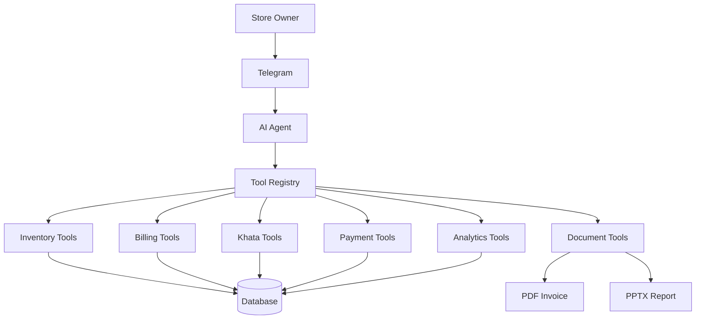

# Nebula KnowLab Supermarket Operations Agent

This repository contains a production-minded supermarket operations agent built around a Telegram-first workflow, deterministic business services, and a seeded demo store. The project is intentionally structured to be extensible, with a clear separation between agent reasoning, business logic, persistence, and presentation.

## Overview

The application is designed for a kirana supermarket owner to operate the store with natural language in Telegram. It supports stock updates, billing, khata tracking, GST-aware calculations, daily close summaries, and document generation.

## Technology Stack

- Python 3.11+
- FastAPI
- SQLAlchemy 2.x
- Pydantic v2
- PostgreSQL-ready config with SQLite fallback for local dev
- python-telegram-bot
- reportlab for PDF generation
- python-pptx for presentation output
- Pytest for automated verification

## Architecture



## Setup

```bash
python -m venv .venv
.venv\Scripts\activate
pip install -r requirements.txt
copy .env.example .env
```

## Run locally

```bash
uvicorn app.main:app --reload
```

## Testing

```bash
pytest -q
```

## Notes

This is a structured, enterprise-style foundation for the requested supermarket agent and intentionally keeps the core logic deterministic and service-backed rather than relying on LLM-generated business math.
